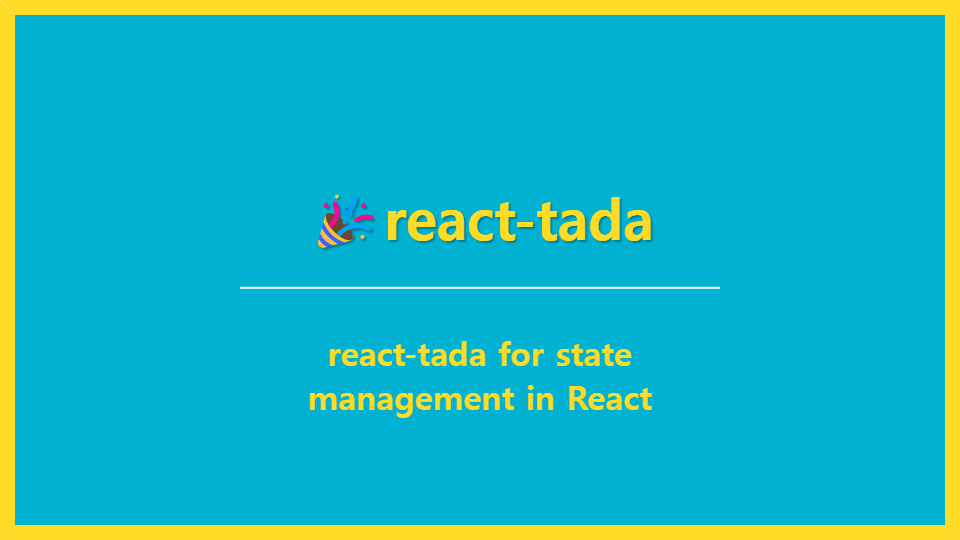
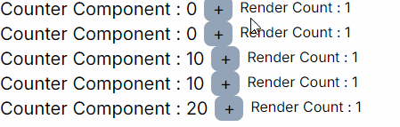

# 🎉react-tada

<p>
  
</p>

[](https://bundlephobia.com/package/react-tada@0.0.1) [](https://www.npmjs.com/package/react-tada)
<br />

## visit [website](https://react-tada-website.vercel.app/) or [npm i react-tada](https://www.npmjs.com/package/react-tada)

- react-tada is a library for state management in React.
- It has a small bundle size.
- It optimizes rendering using selector functions.
- It uses a simple tada creator interface that requires no complex explanations.
- react-tada는 리액트에서 상태 관리를 위한 라이브러리입니다.
- 작은 번들 사이즈를 가졌습니다.
- 선택자 함수를 사용해 렌더링 최적화합니다.
- 복잡한 설명이 필요 없는 간단한 tada 생성자 인터페이스를 사용합니다.

```
npm i react-tada
```

<br />

## First create a Tada!

Tada is a hook.
Without needing a complicated explanation, you can **easily create a Tada**.
<br />
Tada는 hook입니다.
복잡한 설명 필요 없이 **간단하게 Tada를 생성**할 수 있습니다.

```jsx
// jsx
import { tada } from 'react-tada;

const useCountTada = tada({ count: 0 });
```

```tsx
// tsx
import { tada } from 'react-tada';

type State {
  count: number;
}

export const useCountTada = tada<State>({ count: 0 });
```

## Then use it in your component and you're done!

You can update the state as simply as `setState` in `useState` without needing to create or select a separate set function.
However, the state should be updated **immutably.**
<br />
별도의 set 함수를 생성하고 선택하지 않아도 `useState`의 `setState`처럼 간단하게 상태를 업데이트할 수 있습니다.
단, 상태는 **불변**으로 업데이트되어야 합니다.

```jsx
const useCount = useCountTada.useTada;

function Counter() {
  const [count, setCount] = useCount((state) => state.count);
  const inc = () => {
    setCount((prev) => ({
      ...prev,
      count: prev.count + 1,
    }));
  };

  return (
    <>
      <h2>{count}</h2>
      <button onClick={inc}>+</button>
    </>
  );
}
```

## Separate states using Provider!

You can also use a Provider.
The Component within the CountProvider will share separate, distinct count values!
<br />
Provider를 사용할 수도 있습니다.
CountProvider 컴포넌트 내의 Component 컴포넌트는 분리된, 서로 다른 count 값을 공유합니다!

```jsx
const CountProvider = useCountTada.TadaProvider;

const App = () => (
  <>
    <CountProvider>
      <Component /> // initial value
      <CountProvider initialState={{ count: 10 }}>
        <Component /> // count: 10
        <CountProvider initialState={{ count: 20 }}>
          <Component /> // count: 20
        </CountProvider>
      </CountProvider>
    </CountProvider>
  </>
);
```

In this way, you can **separate states even in the sub-tree.**
<br />
이처럼 **하위 트리에서도 상태를 분리**할 수 있습니다.

## Example: Simple Counter App

First, create the useCountTada hook using the Tada constructor interface.
<br />
먼저, tada 생성자 인터페이스를 사용하여 useCountTada 훅을 생성합니다.

```ts
> tada.ts

import { tada } from 'react-tada';

interface CountState {
  count: number;
}

export const useCountTada = tada<CountState>({ count: 0 });
```

Generate the count state and setCount to update the state. Additionally, add renderCount to check the number of times the component is rendered.
<br />
count 상태와 상태를 업데이트 할 setCount를 생성합니다. 그리고 컴포넌트가 렌더링되는 횟수를 체크하기 위해 renderCount를 추가합니다.

```tsx
>  Counter.tsx

const useCount = useCountTada.useTada;

const Counter = () => {
  const [count, setCount] = useCount((state) => state.count);
  const renderCount = useRef(1);

  useEffect(() => {
    renderCount.current += 1;
  });

  return (
    <>
      <div>
        <h2>Counter Component : {count}</h2>
        <button
          onClick={() => {
            setCount((prev) => ({ ...prev, count: prev.count + 1 }));
          }}
        >
          +
        </button>
        <p>Render Count : {renderCount.current}</p>
      </div>
    </>
  );
};

export default Counter;
```

Finally, create the TadaProvider using the useCountTada hook, then generate the sub-tree structures where you want to separate the state.
<br />
마지막으로 useCountTada 훅을 사용하여 간단하게 TadaProvider를 생성한 뒤, 상태를 분리하고 싶은 하위 트리 구조들을 생성합니다.

```tsx
> CounterPage.tsx

const CountProvider = useCountTada.TadaProvider;

const CounterPage = () => {
  return (
    <>
      <Counter /> // count : 0
      <Counter /> // count : 0
      <CountProvider initialState={{ count: 10 }}>
        <Counter /> // count : 10
        <Counter /> // count : 10
        <CountProvider initialState={{ count: 20 }}>
          <Counter /> // count : 20
        </CountProvider>
      </CountProvider>
    </>
  );
};

export default CounterPage;
```

By using TadaProvider in this way, you can separate states and prevent specific tree state changes from affecting rendering and other impacts.
<br />
이처럼 TadaProvider를 사용하면 상태를 분리할 수 있으며, 특정 트리 상태 변경이 리렌더링과 같은 영향을 미치지 않게 할 수 있습니다.

<p>
  
</p>
